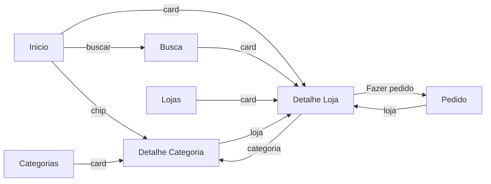

# Interface iFood — Trabalho 2 (MAF: Mínimo Aplicativo Funcional)

App Android em **Kotlin + Jetpack Compose** inspirado no iFood. É a continuação do
Trabalho 1 ([InterfaceIfood2](https://github.com/LucasHartinger19/InterfaceIfood2)):
as 3 telas que antes eram só visuais agora navegam de verdade, e o app ganhou listas
de **Lojas** e **Categorias** em que dá para adicionar, remover, editar e ver detalhes.

> Integrantes: _preencher com os nomes do trio_

---

## Como rodar

1. Clone o repositório:
   `git clone <url-deste-repositório>`
2. Abra a pasta no **Android Studio** (File → Open).
3. Espere o **Gradle Sync** terminar. Se o Android Studio sugerir atualizar versões
   (AGP, Kotlin, Compose BOM), pode aceitar.
4. Escolha um emulador (ou celular com depuração USB) e clique em **Run ▶**.

Requisitos: Android Studio recente, JDK 17+ e minSdk 24 (Android 7.0).

Dependência nova em relação ao Trabalho 1 (`app/build.gradle.kts`):

```kotlin
implementation(libs.androidx.navigation.compose)          // Navigation Compose 2.9.3
implementation(libs.androidx.compose.material.icons.core) // ícones (Home, Search, Delete...)
```

---

## Telas (7 navegáveis)

| # | Tela | Origem | O que faz |
|---|------|--------|-----------|
| 1 | **Início** | Trabalho 1, evoluída | Busca (envia o texto para a tela de Busca), chips de categoria que abrem o Detalhe da Categoria, top 4 lojas por nota, atalho para o pedido |
| 2 | **Busca** | Trabalho 1, evoluída | Filtra as lojas pelo nome ou categoria e por filtros reais (melhor avaliação, mais rápido, entrega grátis, favoritas) |
| 3 | **Acompanhar Pedido** | Trabalho 1, evoluída | Mostra o pedido feito no Detalhe da Loja, barra de progresso, botão para avançar o status, cancelar/finalizar e ajuda |
| 4 | **Lista de Lojas** | Nova | `LazyColumn` + `Card`; formulário para adicionar; lixeira para remover; coração para favoritar |
| 5 | **Detalhe da Loja** | Nova | Dados da loja + categoria, ranking, edição da nota, simulador de total e botão "Fazer pedido" |
| 6 | **Lista de Categorias** | Nova | `LazyColumn` + `Card`; formulário com campo de várias linhas; **segurar** o card remove |
| 7 | **Detalhe da Categoria** | Nova | Estatísticas calculadas, lojas da categoria e edição de nome/descrição |

A **NavigationBar** (barra inferior) dá acesso a Início, Busca, Lojas, Categorias e Pedido.
As telas de detalhe e as listas usam **TopAppBar** com botão de voltar (`popBackStack()`).



---

## Estrutura do código

```
app/src/main/java/com/example/interfaceifood/
├── MainActivity.kt            → só chama AppNavigation() dentro do tema
├── model/Modelos.kt           → data classes Loja e Categoria + formatação (R$, nota)
├── dados/DadosApp.kt          → listas reativas (mutableStateListOf) e funções de add/remover/editar
├── navegacao/
│   ├── Rotas.kt               → object Rotas com as rotas em const val String
│   └── AppNavigation.kt       → Scaffold + NavHost central + NavigationBar
├── componentes/Componentes.kt → BarraTopo (TopAppBar), CardLoja, AvatarLetra, LinhaInfo...
├── telas/                     → uma tela por arquivo
└── ui/theme/Theme.kt          → cores do app (vermelho iFood)
```

---

## Documentação do processo e das decisões

> ⚠️ A documentação precisa de **prints ou vídeo** do app funcionando (seção 4 do enunciado).
> Coloquem as imagens na pasta `docs/prints/` com os nomes abaixo (ou troquem os links).

### 1. Como estava no Trabalho 1 e o que mudou

No Trabalho 1 o projeto tinha 3 telas (`TelaInicial`, `TelaBusca`, `TelaAcompanharPedido`)
com dados fixos em funções como `obterLojasRecomendadas()`. Os botões e chips existiam,
mas não faziam nada (`onClick = {}`), e cada tela tinha sua própria data class
(`Loja`, `ResultadoBusca`, `Filtro`), mesmo com campos repetidos.

O que mudou:
- As data classes foram unificadas em **`Loja`** e **`Categoria`**, e a loja passou a guardar o
  `categoriaId` (antes a categoria era só um texto).
- Os dados saíram das funções fixas e foram para listas reativas (`mutableStateListOf`) em `DadosApp`.
- Todas as telas foram ligadas por um **NavHost** com **NavigationBar** e **TopAppBar**.
- Todo botão/chip/card passou a ter uma ação real (navegar, filtrar, adicionar, remover, editar).

| Trabalho 1 | Trabalho 2 |
|---|---|
|  |  |

### 2. Por que essas telas novas

- **Lista de Lojas / Detalhe da Loja**: as lojas são o centro de um app de delivery. A lista é
  onde se cadastra e gerencia; o detalhe é onde o usuário decide e faz o pedido.
- **Lista de Categorias / Detalhe da Categoria**: as categorias já apareciam como chips no
  Trabalho 1, mas eram texto solto. Virando um item de verdade, dá para cadastrar novas e
  ver todas as lojas de uma categoria.
- O **Acompanhar Pedido** passou a ter sentido: ele mostra o pedido feito no Detalhe da Loja.

 

### 3. Decisões de configuração e organização do código

- **Rotas em um `object Rotas`** com `const val`, como pedido. Para rotas com argumento
  (`detalhe_loja/{lojaId}`) criamos funções `Rotas.detalheLoja(id)` que montam a rota —
  assim ninguém escreve a string na mão e erra o nome.
- **Passagem de dados pelo id**: a lista manda só o `id` pela rota; o detalhe lê com
  `backStackEntry.arguments?.getString("lojaId")` (igual à aula) e busca o item na lista.
  Passar o id (e não o nome) garante que, se a loja for editada, o detalhe mostra a versão nova.
- **A Busca recebe um argumento opcional** (`busca?termo={termo}`, com `navArgument` e
  `defaultValue = ""`), para o texto digitado no Início chegar até ela.
- **Listas num `object DadosApp`**: as duas listas ficam num único lugar compartilhado.
  Assim uma loja adicionada aparece na Busca, no Início e no Detalhe da Categoria sem
  precisar passar a lista por parâmetro para todas as telas.
- **NavHost dentro de um `Scaffold`** com a `NavigationBar` no `bottomBar`. Ao trocar de aba
  usamos `popUpTo(Rotas.INICIO)` + `launchSingleTop`, para a pilha de telas não crescer
  sem fim e o voltar do celular sempre levar ao Início.
- **Componentes reaproveitados** (`CardLoja`, `BarraTopo`) em vez de copiar o mesmo card em
  4 telas, como acontecia no Trabalho 1.
- **Dois mecanismos diferentes de remover**: na lista de lojas é pelo ícone de lixeira;
  na de categorias é segurando o card (`combinedClickable`). Uma categoria só pode ser
  removida se não tiver lojas (senão a loja ficaria sem categoria).

### 4. A complexidade extra no Detalhe

O **Detalhe da Loja** faz mais do que reexibir os campos:
1. **Combina as duas listas**: mostra a categoria da loja e calcula o ranking dela entre
   as lojas da mesma categoria ("2º melhor avaliada de 3").
2. **Navegação secundária**: tocar na categoria abre o Detalhe da Categoria; o botão
   "Fazer pedido" abre o Acompanhar Pedido com aquela loja.
3. **Edição no próprio detalhe**: um `Slider` muda a nota e o coração na TopAppBar marca
   como favorita — a mudança aparece na lista e na busca na hora.
4. **Informação calculada**: simulador de pedido (valor dos itens + taxa = total) e tempo médio.

O **Detalhe da Categoria** também calcula quantidade de lojas, nota média, taxa média e
quantas têm entrega grátis, e permite editar nome e descrição.

Escolhemos isso porque _(preencher: por que o trio escolheu essa complexidade)_.

 

### 5. Dificuldades e como resolvemos

_(Preencher com as dificuldades reais do trio.)_ Exemplos de pontos que costumam travar:
- Entender por que o argumento da rota chega como `String` e precisa de `toIntOrNull()`.
- O `TopAppBar` dentro de uma tela que já está num `Scaffold` ficava com espaço duplicado
  em cima — resolvido com `windowInsets = WindowInsets(0, 0, 0, 0)`.
- A aba da barra inferior não ficava marcada nas telas de detalhe — resolvido verificando a
  rota atual com `currentBackStackEntryAsState()`.

---

## Roteiro da apresentação

1. Navegar pela barra inferior por todas as abas.
2. **Lojas** → `+` → cadastrar uma loja → aparece na lista → tocar nela → detalhe certo abre.
3. No detalhe: mudar a nota, favoritar, tocar na categoria (abre o detalhe da categoria).
4. Voltar → remover a loja na lixeira.
5. **Categorias** → adicionar uma categoria → abrir o detalhe → segurar para remover.
6. Detalhe de uma loja → **Fazer pedido** → avançar o status até "Entregue".

> Os dados ficam só na memória: ao fechar o app, as listas voltam ao padrão (persistência é
> assunto do próximo trabalho).
